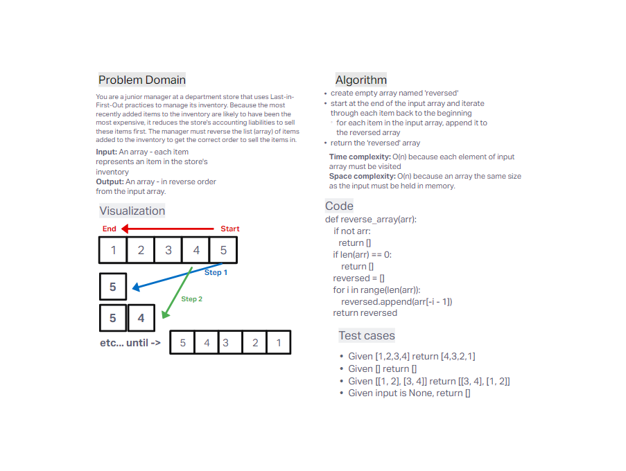

# Reverse an Array
Write a function called `reverseArray` which takes an array as an argument. Without utilizing any of the built-in methods available to your language, return an array with elements in reversed order.

## Whiteboard Process

## Approach & Efficiency
I took the approach of iterating backwards through the input array and appending each element onto a new array. This took advantage of the fact that Python allows negative indexing.

- Time complexity =  O(n) because each element of the input array must be visited.
- Space complexity = O(n) because an array of equal size to the input must be held in memory.
