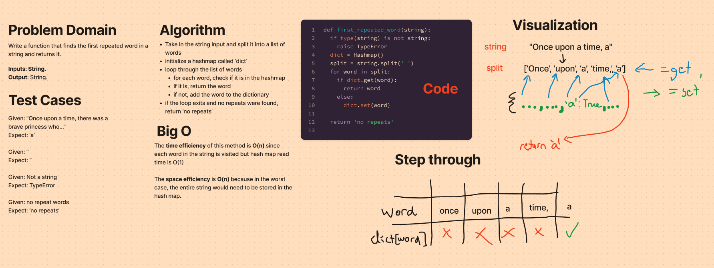

# Hashtable repeated word

Write a function called repeated word that finds the first word to occur more than once in a string
Arguments: string
Return: string

## Whiteboard Process


## Approach & Efficiency

The time efficiency of this method is O(n) since each word in the string is visited but hash map read time is O(1)

The space efficiency is O(n) because in the worst case, the entire string would need to be stored in the hash map.

## Solution

```python
first_repeated_word('dog cat dog bus boots')

# returns 'dog'
```
