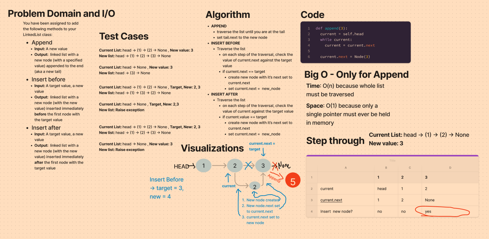

# Challenge Summary
Add three new methods to the Linked List class:
- Append
- Insert Before
- Insert After


## Whiteboard Process


## Approach & Efficiency
- All new methods require list traversal
- Insert before looks ahead at the value of current.next
- Insert after compares target value vs current value

### Efficiency
- All methods are O(n) for TIME because they require traversing the list
- All methods are O(1) for SPACE since they just need to hold pointers in memory

## Solution

```python
# Assume a linked list like this exists: head -> (1) -> None
example_list.append(2)

# Now the list should look like this:  head -> (1) -> (2) -> None

```
