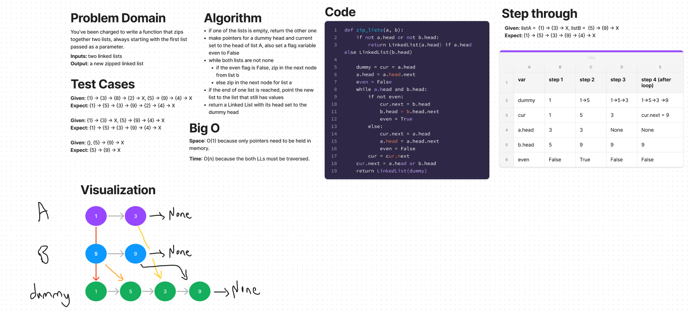

# Challenge Summary
Create a function that zips two linked lists together, always starting with 'list_a'.


## Whiteboard Process


## Approach & Efficiency
- This method requires alternatively traversing two lists. A flag variable whose status is differentially set in the while loop enables the alternation of adding nodes from the 2 lists.

### Efficiency
- Function is O(n) for TIME because it requires traversing each list.
- Methods are O(1) for SPACE since it only requires holding pointers to head nodes and a flag variable in memory.

## Solution

```python
# list_a: (1) -> (2) -> None
# list_b: (3) -> (4) -> None

zip_lists(list_a, list_b)

# it should return (1) -> (3) -> (2) -> (4) -> None
```
## [Link to code](https://github.com/dennis-nichols/data-structures-and-algorithms/blob/main/python/code_challenges/linked_list_zip.py)

