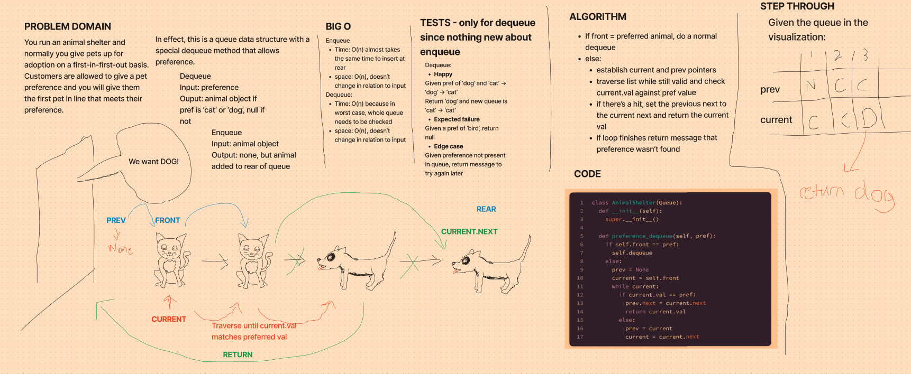

# Stacks and Queues

Implemented a special queue data structures for an animal shelter (DSs).
https://github.com/dennis-nichols/data-structures-and-algorithms/blob/main/python/code_challenges/stack_queue_animal_shelter.py

## Challenge

For the animal shelter class:

- Implement a special dequeue method that allows a user to give a preference of a cat or a dog. If the preference is found, return it, if not return a target error. If the preference is invalid, return None.

## Whiteboard

## Approach & Efficiency

The time efficiency of the special method is O(n) since the whole queue may need to be traversed.
The space efficiency is O(1) since it doesn't change with the input.

## API

**enqueue**
Arguments: value
Adds a new node with that value to the back of the queue with an O(1) Time performance.

**dequeue**
Arguments: pref
Returns: the value of the first node in the queue that meets the preference.
Removes the node from the queue.
Should raise exception when called on empty queue or when the pref is not found.
Returns null if pref is invalid.
