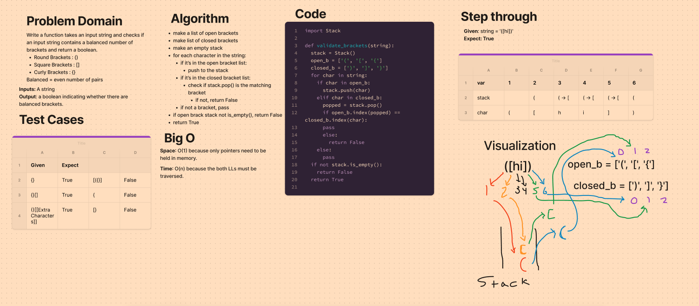

# Stack Queue Brackets
## Challenge
Implement a validate brackets function that checks a string for balanced brackets.
https://github.com/dennis-nichols/data-structures-and-algorithms/blob/main/python/code_challenges/stack_queue_brackets.py

## Whiteboard

## Approach & Efficiency
The approach uses a stack to keep track of open brackets and each time a closed bracket is encountered, the top node of the stack is checked to see if it is the correct matching bracket.

The time efficiency of the special method is O(n) since each character in the string must be visited.
The space efficiency is O(1) since it doesn't change in relation to the input - this is because the stack used only knows its top node.

