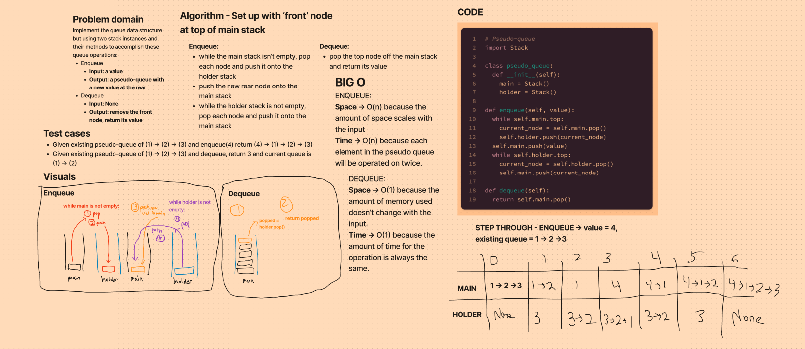

# Stacks and Queues

Implemented the pseudo-queue DS. This uses to Stack DSs to mimic the functionality of an actual queue.

https://github.com/dennis-nichols/data-structures-and-algorithms/blob/main/python/code_challenges/stack_queue_pseudo.py

## Challenge

For the above DSs implement methods for the following actions:

- Node addition at the 'rear' of the queue -> ENQUEUE
- Remove and return value of node at 'front' of the queue -> DEQUEUE

## Approach & Efficiency

- Enqueue: O(n) for TIME and SPACE because the amount of operations and memory used scale with the input.
- Dequeue: O(1) for TIME and SPACE because the amount of operations and memory used are independent of the input.

## Whiteboard

### Pseudo-queue

**Enqueue**
Arguments: value
Adds a node to the rear of the queue.

**Dequeue**
Arguments: none
Returns: the value from node from the front of the queue.
Removes the node from the front of the stack.
Should raise exception when called on empty queue.
