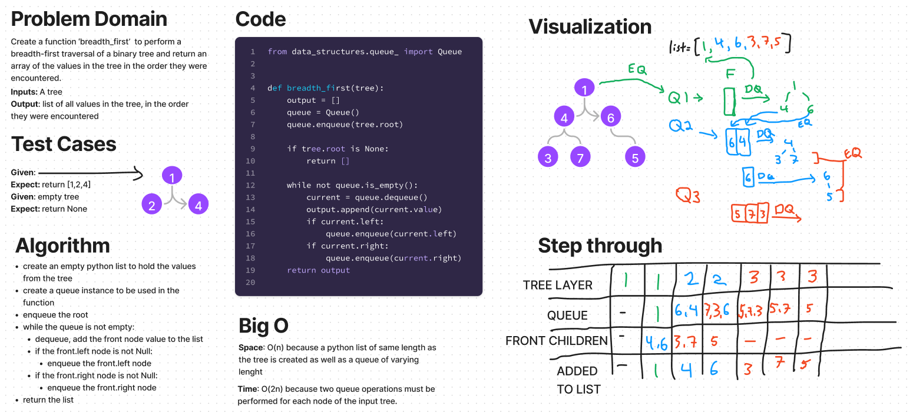

# Breadth-first traversal
## Challenge
Implement a function that does a breadth-first traversal of an input tree and returns a list of node values in the order they are encountered.
https://github.com/dennis-nichols/data-structures-and-algorithms/blob/main/python/code_challenges/tree_breadth_first.py

## Whiteboard



## Approach & Efficiency
The approach uses a queue to ensure that nodes are added to a python list in the correct breadth-first order.

The time efficiency of this method is O(2n) because two queue operations must be performed for each node of the input tree.
The space efficiency is O(n) because a python list of same length as the tree is created as well as a queue of varying length.

## Solution

```python
#     1
#  3     4
# 5  6  7  8


breadth_first(tree)
# should return [1,3,4,5,6,7,8]
```
