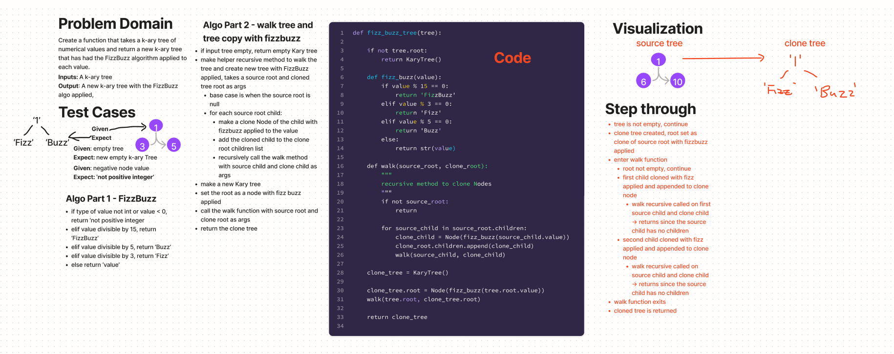

# Tree fizz buzz
## Challenge
Implement a function that takes a k-ary tree as an input and returns a cloned tree with the FizzBuzz algorithm applied to each node value.
https://github.com/dennis-nichols/data-structures-and-algorithms/blob/main/python/code_challenges/tree_breadth_first.py

## Whiteboard



## Approach & Efficiency
A depth-first recursive approach is used to visit each node of the input tree, clone the node with the FizzBuzz algo applied and add the cloned node to a cloned K-ary tree.

The time efficiency of this method is O(n) because the number of operations to be performed is linearly proportional to the number of nodes in the source tree.
The space efficiency is O(n) because a K-ary tree of same size as the source tree is created and held in memory.

## Solution

```python
#     1
#  3     4
# 5    6  7  8


fizz_buzz_tree(tree)
# should return:
#     '1'
#  'Fizz       '4'
# 'Buzz'    'Fizz'  '7'  '8'
```
