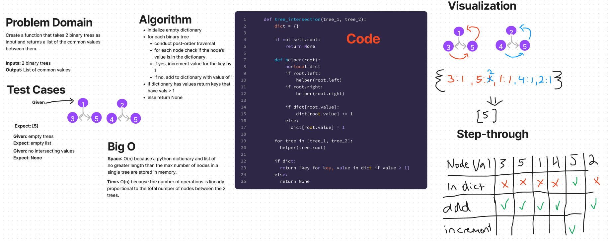

# Tree fizz buzz
## Challenge
Implement a function that takes 2 binary trees as an input and returns the intersection of their node values as a list.


## Links
https://github.com/dennis-nichols/data-structures-and-algorithms/blob/main/python/code_challenges/tree_intersection.py


## Whiteboard



## Approach & Efficiency
A depth-first recursive approach is used to visit each node of each input tree. For each node, it's value is either added to a dictionary or that dictionaries value is updated. In the end, the intersecting set of values between the trees is returned as a list.

Time: O(n) because the number of operations is linearly proportional to the total number of nodes between the 2 trees.
Space: O(n) because a python dictionary and list of no greater length than the max number of nodes in a single tree are stored in memory.

## Solution

```python
# tree_1
#     1
#  3     4

# tree_2
#     1
#  3     5

tree_intersection(tree_1, tree2)
# should return: [3, 1]
```
