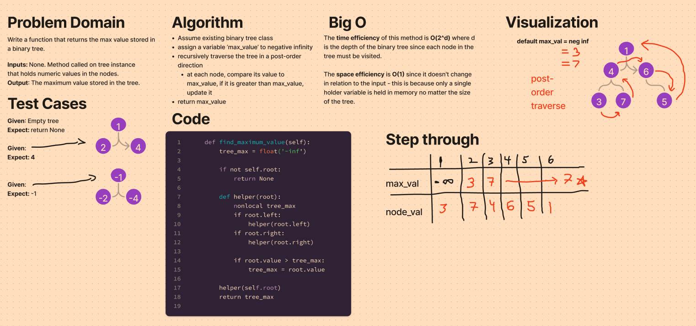

# Stack Queue Brackets
## Challenge
Implement a find_maximum_value function that returns the max value stored in a binary tree.
https://github.com/dennis-nichols/data-structures-and-algorithms/blob/main/python/data_structures/binary_tree.py

## Whiteboard



## Approach & Efficiency
The approach uses a variable that initially is set to negative infinity. The method then does a depth-first post-order traversal of the tree and checks if each node's value is greater than the current value of the max_value holder. The max value is returned at the end.

The time efficiency of this method is O(2^d) where d is the depth of the binary tree since each node in the tree must be visited.
The space efficiency is O(1) since it doesn't change in relation to the input - this is because only a single holder variable is held in memory no matter the size of the tree.

## Solution

```python
#     1
#  3     4
# 5  6  7  8


tree.find_maximum_value()
# should return 8
```
