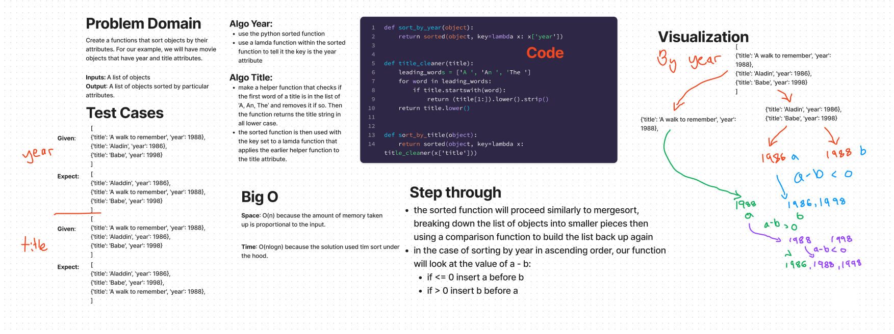

# Challenge 28 - Sorting Comparisons
Write functions which sort domain objects. Your functions will receive an array of Movie objects. Each Movie object has a title (string), a year (number), and a list of genres (array of strings). One function will sort the movies by most recent year first. One function will sort the movies, alphabetical by title, but will ignore any leading “A”s, “An”s, or “The”s. Test outputs for these functions, and an array of sample data, have been provided in test and movies.

## Whiteboard Process



## Approach & Efficiency
Space: O(n) because the amount of memory taken up is proportional to the input.
Time: O(nlogn) because the solution used tim sort under the hood.

## Solution

```python
from movies import movies
sorted = sort_by_year(movies)
```

