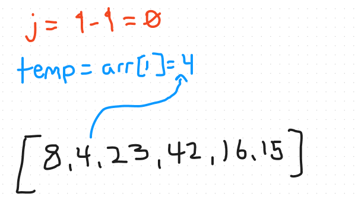

# Blog Notes: Insertion Sort


The psedocode below is an example of the **insertion sort** algorithm:
```
 InsertionSort(int[] arr)

    FOR i = 1 to arr.length

      int j <-- i - 1
      int temp <-- arr[i]

      WHILE j >= 0 AND temp < arr[j]
        arr[j + 1] <-- arr[j]
        j <-- j - 1

      arr[j + 1] <-- temp
```

## Pseudocode explained

The following steps explain what is happening in the pseudocode above assuming you had an input array of `[8, 4, 23, 42, 16, 15]`.
*The numbers to the right of each line indicate what the variable is assigned to on the first loop iteration.*

1. `FOR i = 1 to arr.length`
    - This line starts a for loop that will iterate through all elements of the input array `[8, 4, 23, 42, 16, 15]`. The loop starts at index 1 of the array, since the first element is already considered sorted.

2. `int j <-- i - 1` => 0
    - This line initializes the variable `j` to `i - 1`, which will be used as a comparison index in the following while loop. In the first iteration, j = 0

3. `int temp <-- arr[i]` => 4
    - This line initializes the variable `temp` to the current value of the element at index `i` of the array. In the first iteration, temp = 4
      

4. `WHILE j >= 0 AND temp < arr[j]` => 0 (TRUE) & 4 < 8 (TRUE)
    - This line starts a while loop that will continue until `j` is less than 0, or until `temp` is no longer less than the element at index `j` of the array.

5. `arr[j + 1] <-- arr[j]` => arr[1] = 8
    - Inside the while loop, this line shifts the element at index `j` of the array to the right by one position.

6. `j <-- j - 1 (-1)`
    - Inside the while loop, this line decrements the value of `j` by 1, which will be used as the next comparison index in the following iteration of the while loop.

7. `arr[j + 1] <-- temp` arr[0] => 4
    - After the while loop, this line assigns the value of `temp` to the current position at `j+1` , which is the final position for the current element.

8. The for loop continues until all elements are sorted.

In the first iteration of the loop, 4 is less than 8 and j = 0, so the loop will swap 4 with 8 and the final array will be [4, 8, 23, 42, 16, 15].

The loop will continue and sort the entire array, the final array will be [4, 8, 15, 16, 23, 42].


